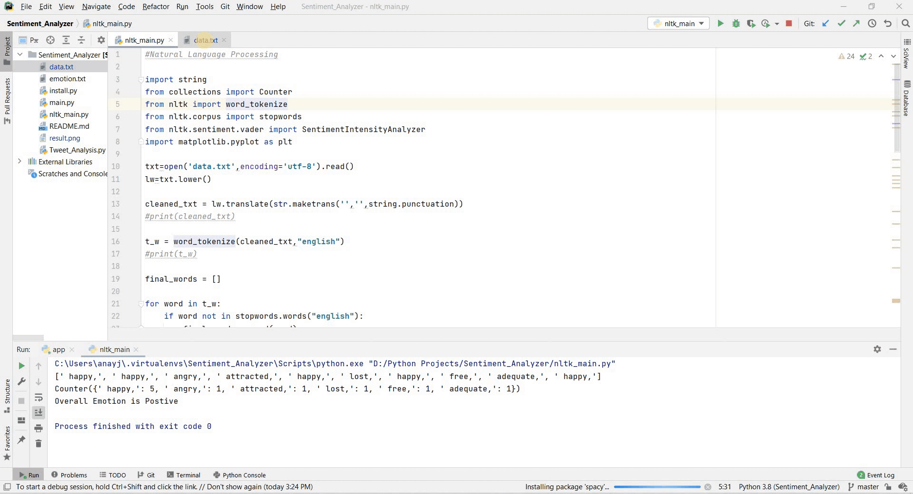

# Sentimeter

This is a sentiment analysis tool that I deveoped as a tutorial project for my Youtube Channel [Coders Life](https://www.youtube.com/playlist?list=PLbtCgUYcYmQ146dR_gVVtHdob0cDPoz7N)
<br>

In this Project, I worked on three different functionalities:
<br>
1. Developing a hardcoded tool using core python only.
2. Used [NLTK](https://www.nltk.org/) for natural language processing.
3. Twitter hashtag sentiment analysis for a date range.
<br>
   
### Working 


   
### What's Unique ?
   
I haven't used any Machine Learning or Data Science Algorithm, to make it easy for understanding and help you learn in depth working of python. 
<br>

### Download

```bash
git clone https://github.com/anayjoshi1608/Sentiment_Analyzer.git
```
### Twitter API

Instead of official twitter api, I have used [GetOldTweets3](https://pypi.org/project/GetOldTweets3/) library for easy access.
